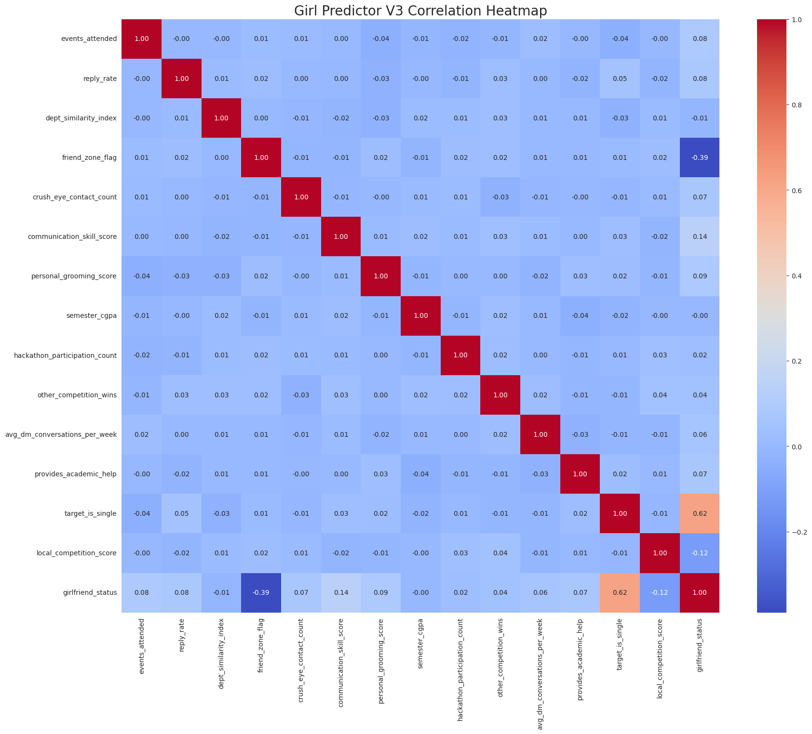

# Girlfriend Predictor V3: An Advanced Machine Learning Project

*An engineering student's fun take on solving life's most pressing classification problem, now updated with advanced social, academic, and environmental features for a more realistic model.*

[](https://colab.research.google.com/drive/1HCgPxf3gdnqQyZgHvqao9dZHn53QUv7D?usp=sharing)

---

<p align="center">
  
</p>

---

## 🧐 Overview

As a B.Tech student at Model Engineering College, I decided to apply machine learning to a critical classification problem: **Will I get a girlfriend in college?**

This is **Version 3** of the project, which moves beyond simple metrics to include a more nuanced and holistic set of features. It now considers academic performance, collaborative spirit, direct communication efforts, and even environmental factors like the "local competition." The result is a more robust and insightful model that better reflects the complexities of real-life social dynamics, all while serving as a practical application of data science principles.

## ✨ Advanced Features (V3)

The V3 model is trained on a richer, more sophisticated synthetic dataset. The features are designed to be more realistic and quantifiable aspects of a student's life.

#### Personal & Habitual Features
* `personal_grooming_score`: (Scale 1-10) An upgrade from the original `uniform_wrinkle_score`. A higher score indicates better personal presentation and outlook.
* `communication_skill_score`: (Scale 1-10) A self-assessed score for soft skills, directly modeling the importance of effective communication.
* `avg_dm_conversations_per_week`: (Number) Quantifies direct digital communication efforts across platforms like Instagram and WhatsApp.
* `crush_eye_contact_count`: (Number) The classic, powerful, but often sparse feature indicating mutual interest.

#### Academic & Technical Features
* `semester_cgpa`: (Number) Your current SGPA/CGPA, serving as a direct measure of academic performance.
* `hackathon_participation_count`: (Number) An upgrade from "wins" to "participation," this shows initiative and passion for technology.
* `other_competition_wins`: (Number) Captures success in other competitive events like coding contests, paper presentations, etc.
* `provides_academic_help`: (Binary: 1=Yes, 0=No) A measure of collaborative spirit—do you help others with assignments, doubts, or projects?

#### Social & Environmental Features
* `events_attended`: (Number) The number of workshops, tech fests, and cultural events you show up to.
* `dept_similarity_index`: (Binary: 1=Yes, 0=No) A simple flag to check if you're in the same department.
* `friend_zone_flag`: (Binary: 1=Yes, 0=No) The classic categorical label with a heavy negative penalty in the model.
* `local_competition_score`: (Scale 1-10) An environmental factor measuring how many "competitors" are also vying for the same person's attention.
* **`target_is_single`**: (Binary: 1=Yes, 0=No) The **game-changer**. This feature introduces a hard, real-world constraint. If the target person is not single, the model learns that a successful outcome is nearly impossible.

## 🔬 Methodology & Concepts

This project follows a standard machine learning pipeline.

#### 1. Logistic Regression
This project uses **Logistic Regression**, a fundamental algorithm for binary classification. It's used to predict a probability (a value between 0 and 1) for a given class, making it perfect for "Yes/No" questions like ours.

#### 2. Feature Scaling (`StandardScaler`)
With many new features on different scales (e.g., `CGPA` from 0-10 vs `events_attended`), scaling is crucial. **Standard Scaling** transforms the data to have a mean of 0 and a standard deviation of 1, ensuring all features contribute fairly to the model's predictions.

#### 3. Model Evaluation
We assess the model's performance using standard metrics:
* **Accuracy**: The percentage of correct predictions.
* **Classification Report**: Shows Precision, Recall, and F1-Score.
* **Confusion Matrix**: Visualizes the model's correct and incorrect predictions (True Positives, False Negatives, etc.).

## 🚀 How to Run

1.  **Clone the repository:**
    ```bash
    git clone https://github.com/dearabhin/girlfriend-predictor.git
    cd girlfriend-predictor
    ```
2.  **Set up a virtual environment and install dependencies:**
    ```bash
    pip install -r requirements.txt
    ```
3.  **Run the script or notebook:**
    * Open and run the `girlfriend_predictor.ipynb` in Google Colab or Jupyter.
    * Alternatively, run the Python script from your terminal: `python girlfriend_predictor.py`

## 🤖 The V3 Simulator
In the code, you can find the `your_current_stats_v3` dictionary. Change the values to reflect your own situation and see what the advanced model predicts for you! Experiment with changing `target_is_single` from 1 to 0 to see its powerful effect.

```python
# --- YOUR TURN: Fill in your stats for the V3 model! ---
your_current_stats_v3 = {
    'events_attended': 15,
    'semester_cgpa': 9.1,
    'provides_academic_help': 1,
    'target_is_single': 1,  # Try changing this to 0!
    'local_competition_score': 6,
    # ... and all the other new features
}